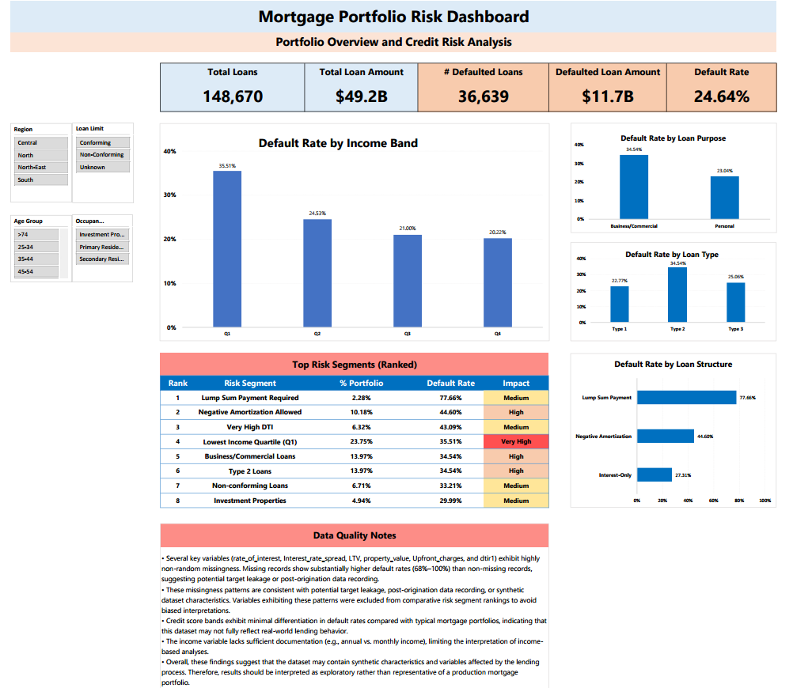

# Mortgage Portfolio Risk Dashboard

## Project Overview

This project analyzes a mortgage loan portfolio containing 148,670 loans to identify borrower, loan, and property characteristics associated with elevated default risk.

The analysis was conducted using Excel Pivot Tables, Pivot Charts, Slicers, and an interactive dashboard.

## Dataset Overview

- Total Loans: 148,670
- Total Loan Amount: $49.2B
- Variables: Borrower, Property, Credit Risk, Loan Structure
- Target Variable: Loan Status (Defaulted / Non-Defaulted)
  
## Business Questions

1. What is the overall risk profile of the mortgage portfolio?
2. Which borrower segments exhibit the highest default rates?
3. Which loan products are associated with elevated default risk?
4. Do business/commercial loans exhibit higher default rates than personal loans?
5. Which loan structure features are associated with elevated risk?
6. What are the highest-risk segments that should be prioritized for monitoring?
## Dashboard

## Key Findings

* The portfolio contains 148,670 loans with a total loan amount of $49.2B.
* 36,639 loans were classified as defaulted, resulting in a 24.64% default rate.
* The total amount associated with defaulted loans is approximately $11.7B.
* **Lowest Income Quartile (Q1)** exhibited the highest default rate (35.51%).
* **Type 2 loans** showed higher default rates than Type 1 and Type 3 loans.
* **Business/Commercial loans** exhibited higher default rates than personal loans.
* **Lump Sum Payment loans** exhibited the highest default rate (77.66%).
* **Negative Amortization loans** exhibited elevated default risk (44.60%).

## Tools Used

* Microsoft Excel
* Pivot Tables
* Pivot Charts
* Slicers
* Conditional Formatting

## Data Quality Considerations

* Missing LTV and DTI values exhibited unusually high default rates and were excluded from risk rankings.
* Credit score bands showed minimal differentiation in default rates, which is inconsistent with typical lending portfolios.
* These patterns suggest potential data quality issues, synthetic data characteristics, or target leakage that should be considered when interpreting results.
