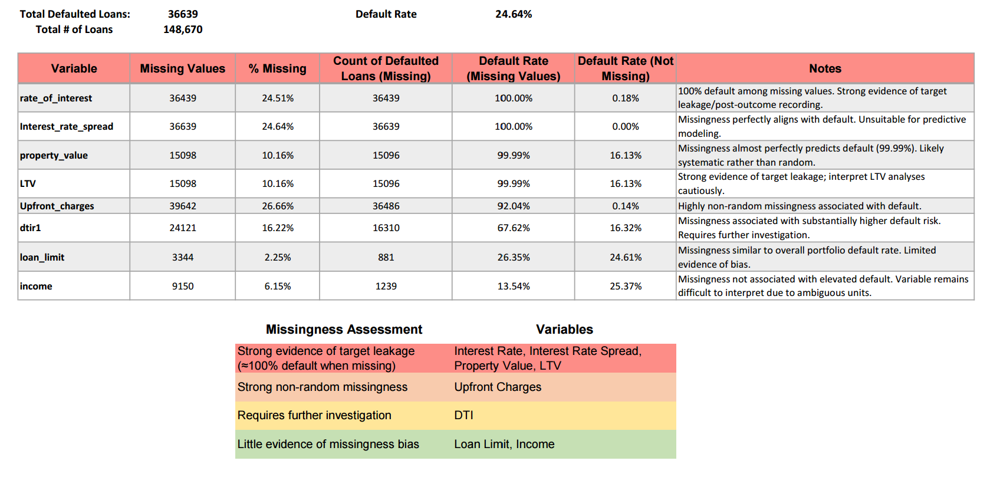

# Mortgage Portfolio Risk Dashboard

## Project Overview

Analyze a mortgage loan portfolio of 148,670 loans to identify borrower, loan, and property characteristics associated with elevated default risk while assessing data quality issues that may affect interpretation.

The project combines data cleaning, exploratory data analysis (EDA), and interactive dashboarding to support portfolio risk assessment.
  
## Business Problem

Mortgage lenders need to understand:
1. Which borrower characteristics are associated with higher default risk?
2. Which loan products contribute most to portfolio risk?
3. Which portfolio segments require closer monitoring?
4. Are there data quality issues that could affect risk analysis?

## Dataset Overview

- Total Loans: 148,670
- Total Loan Amount: $49.2B
- Variables: Borrower, Property, Credit Risk, Loan Structure
- Target Variable: Loan Status (Defaulted / Non-Defaulted)

  Variables:
• Borrower demographics
• Income
• Credit characteristics
• Property characteristics
• Loan structure
• Loan purpose

## Project Workflow
Raw Data
      ↓
Data Cleaning
      ↓
Exploratory Data Analysis
      ↓
Missing Value Assessment
      ↓
Dashboard Development
      ↓
Business Insights

## Dashboard

## Missing Value Assessment

Missing-value analysis revealed that several variables exhibited highly non-random missingness strongly associated with default (67–100%), suggesting potential target leakage or post-origination recording. Variables affected by these patterns were excluded from comparative risk rankings.

## Executive Summary

* Portfolio default rate is **24.64%**, representing approximately **$11.7B** in defaulted loan amount.
* Loan structure is one of the strongest differentiators of default risk, with **Lump Sum Payment Required (77.66%)** and **Negative Amortization (44.60%)** exhibiting the highest default rates.
* Borrowers in the lowest income quartile demonstrate substantially **higher default risk** than higher-income groups.
* **Business/Commercial loans** consistently outperform Personal loans in default rate.
* Missingness analysis identified several variables exhibiting strong evidence of target leakage or post-origination recording.

## Data Quality Considerations

* Missing-value analysis identified multiple variables (Interest Rate, Interest Rate Spread, Property Value, LTV, and Upfront Charges) exhibiting highly non-random missingness strongly associated with default (92–100%). These patterns suggest potential target leakage or post-origination recording, and these variables should be interpreted cautiously in comparative risk analysis.
* Credit score bands exhibit relatively weak separation compared with typical mortgage portfolios.
* Income lacks documentation regarding reporting units, limiting interpretation.
* Thirty-three observations contained LTV values exceeding 100%. Their impact on portfolio-level results was identified as an area for future investigation.
